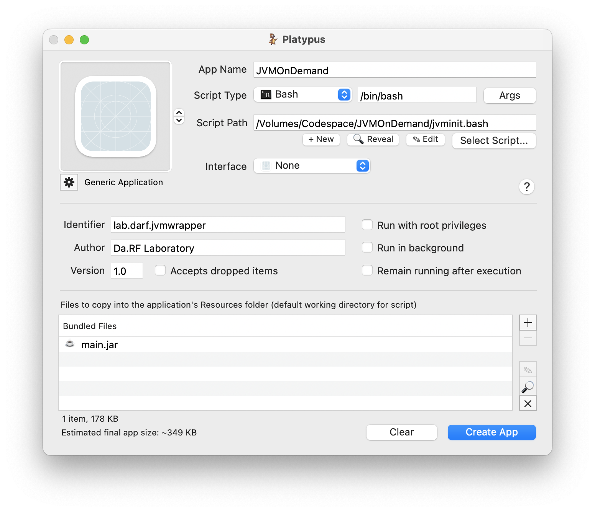

# JVMOnDemand

The biggest problem of Java Desktop Application is using Java Virtual Machine. Users have to install JVM before using the application. To resolve the problem, JVMOnDemand will automatically install OpenJDK on Mac under user's permission.

jvminit.bash will automatically launched and will check if ```java``` command is available or not. If not, it will install OpenJDK 17.0.2 and launch the Jar application.


## Method 1 - Using Platypus from scratch (Recommended)

1. [Download Platypus](http://sveinbjorn.org/platypus).
2. Put all settings like below. You may change App Name, Identifier, Author, and Version. For script path, you just need to select jvminit.bash script in this repository. Path does not matter. **JAR file must be named main.jar in order for jvminit.bash to recognize.**
3. 
4. Press create app.
5. Done!


## Method 2 - Using pre-built wrapper

1. Right click JVMOnDemand.app, then click Show Package Contents.
2. Go to Contents -> Resources.
3. Add your own main.jar. **The jar file must be named "main.jar". **
4. Done!

